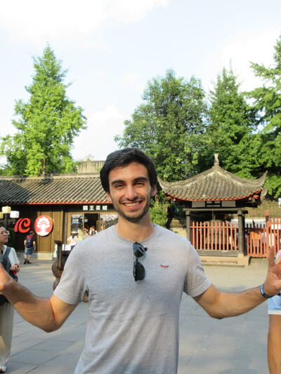

  
  
  <h1>Hi, I'm Tomás Coelho 👋</h1>
  <h3>MSc Aerospace Engineering (Embedded Systems) @ ISAE-SUPAERO</h3>
  <h4>BSc Aerospace Engineering @ Instituto Superior Técnico</h4>
  
  
Computer Vision • Visual Localization • Feature Matching • Embedded Systems

  

    
    
    
  

---

## 👨‍💻 About Me

I am a Computer Vision engineer and researcher focused on **visual localization in GPS-denied environments**, with a strong interest in feature matching, aerial perception, synthetic data, and robust vision systems under domain shift. 

I combine an aerospace engineering background with hands-on experience building end-to-end ML systems, from research experiments to deployable benchmarking pipelines.

* 🎓 **ISAE-SUPAERO (MSc, Embedded Systems)** — CGPA: **3.86/4.0** *(Expected Dec 2026)*
* 🎓 **Instituto Superior Técnico (BSc, Aerospace Engineering)** — Final Grade: **15/20** *(Jun 2024)*
* 📍 **Location:** Toulouse, France
* 💼 **Open to:** Research collaborations, internships, and applied CV/ML opportunities

---

## 🎯 Current Focus
* Visual localization for **GPS-denied drone navigation**
* **Drone-to-satellite matching** and aerial georegistration
* Learned local feature matching with **ELoFTR / LoFTR-style pipelines**
* Synthetic data generation with **ControlNet**
* Segmentation pipelines for agricultural and remote perception tasks

---

## 🚀 Featured Work

### Visual Localization for GPS-Denied Drone Navigation
*Worked on feature-matching systems and benchmarking for a Series A startup focused on localization in GPS-denied environments.*

* Built a real-flight benchmark for **drone-to-satellite visual localization**.
* Evaluated multiple matchers including **POLARIS, ELoFTR, RoMa, and XFeat**.
* Used downstream metrics such as **SR@75, recall, localization error, latency, and FPS**.
* Adapted **EfficientLoFTR** for aerial localization with homography-based supervision and temporal satellite pair mining.
* **Result:** Achieved internal **SOTA** with 65.0% SR@75 at ~35 FPS, outperforming ELoFTR by 39% and XFeat by 142% on SR@75 at comparable throughput, and running 12x faster than RoMa.

### Synthetic Data for Hierarchical Panoptic Segmentation
*ISAE-SUPAERO* | 

* Benchmarked a 3-stage **Mask2Former** pipeline on **PhenoBench**.
* Built a **ControlNet-based augmentation workflow** for generating synthetic image-mask pairs.
* Integrated synthetic samples into the training pipeline for low-label agricultural perception.
* **Result:** Reduced validation loss from 9.91 to 9.85 and improved PQ+ from 82.95 to ~83.0.

### ControlNet + Semantic Segmentation Pipeline
*Designed a unified experimentation pipeline for comparing synthetic-data strategies on PhenoBench.*

* Built a pipeline with 2 augmentation modes: **ControlNet-based generative augmentation** and **Classic copy-paste augmentation**.
* Automated the full workflow: mask/caption generation, ControlNet training, dataset preparation, DeepLabv3+ training, and validation/testing.
* Ran scaling studies across 25 synthetic-data configurations from 110 to 2000 added samples.
* **Result (on a 266-image training set):** Baseline 0.8349 mIoU. Best copy-paste: 0.8686 mIoU. Best ControlNet: 0.8644 mIoU. Hardest class IoU improved from 0.5837 to 0.6675.

### ATLAS UAV — Air Cargo Challenge 2024
* Led the **Tail & Fuselage Structures** department for a 12-person team.
* Coordinated structural design, simulation, and manufacturing.
* Balanced weight, manufacturability, and compliance with competition rules in a multidisciplinary environment.

---

## 💻 Technical Skills

**Languages**  

**Computer Vision & ML**  

`Kornia` `PyTorch Lightning` `DeepLabv3+` `Mask2Former` `ControlNet` `Image Segmentation` `Local Feature Matching` `Homography Estimation` `RANSAC`

**Tools & Infrastructure**  

`Weights & Biases` `SolidWorks`

**Domains**  
`Visual Localization` `Drone-to-Satellite Matching` `GPS-Denied Navigation` `Aerial Image Registration` `Synthetic Data Generation` `Domain Shift Perception`

---

## 📜 Certifications

* 🏅 [Machine Learning Specialization](https://www.coursera.org/account/accomplishments/specialization/2SNHSVNZKBVZ)
* 🏅 [Advanced Learning Algorithms](https://www.coursera.org/account/accomplishments/verify/JW4185DGSYPO)
* 🏅 [Supervised ML: Regression & Classification](https://www.coursera.org/account/accomplishments/verify/YQO9TBAD5WPC)
* 🏅 [Unsupervised Learning, Recommenders & Reinforcement Learning](https://www.coursera.org/account/accomplishments/verify/MGC6NJR0SNLN)

---

## 🔭 Interests

* Visual localization and navigation
* Feature matching for real-world robotics
* Computer vision for aerospace and remote sensing
* Robust perception in low-data environments
* Research-to-engineering workflows in ML systems
